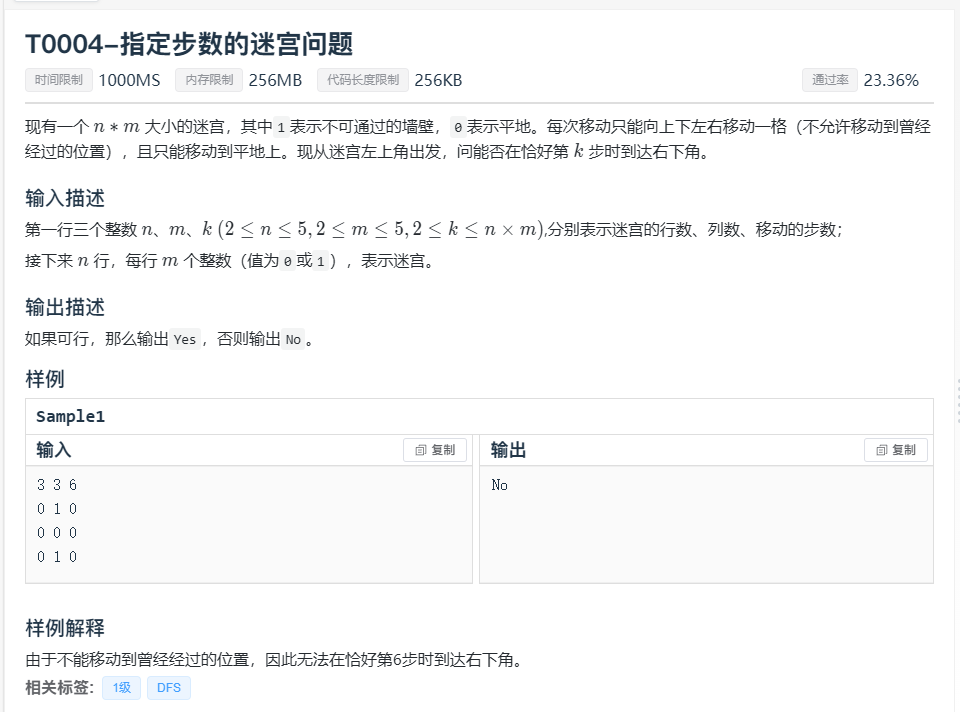
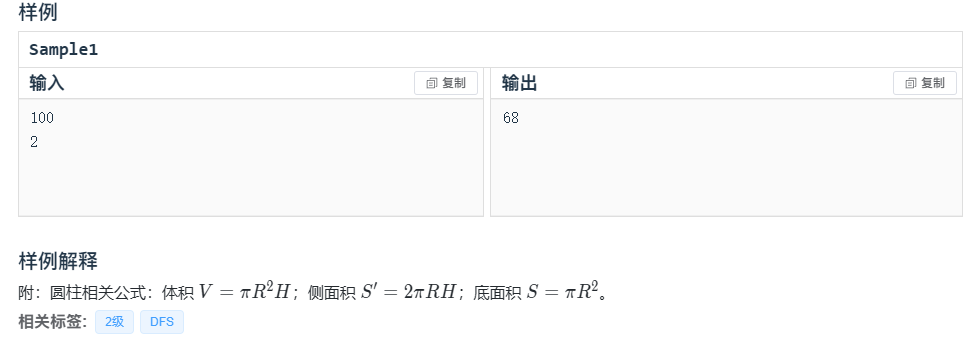
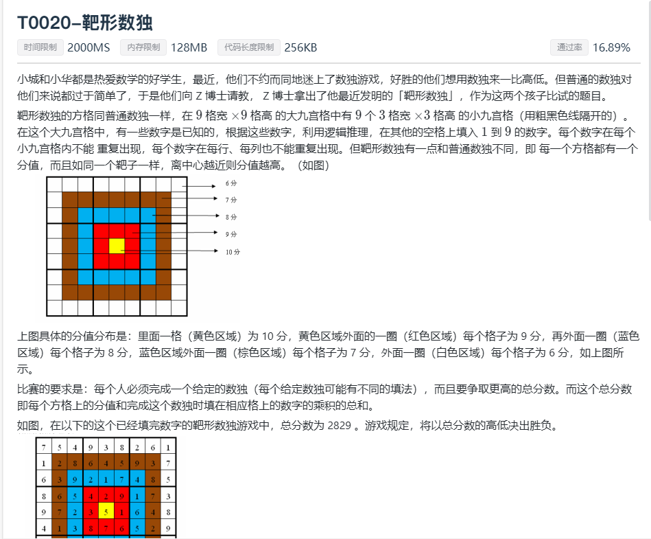
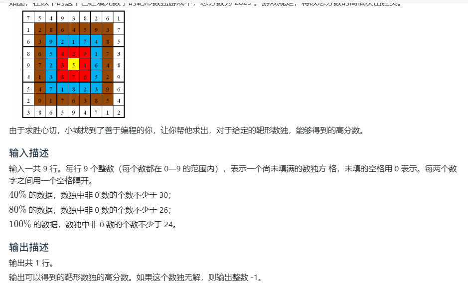
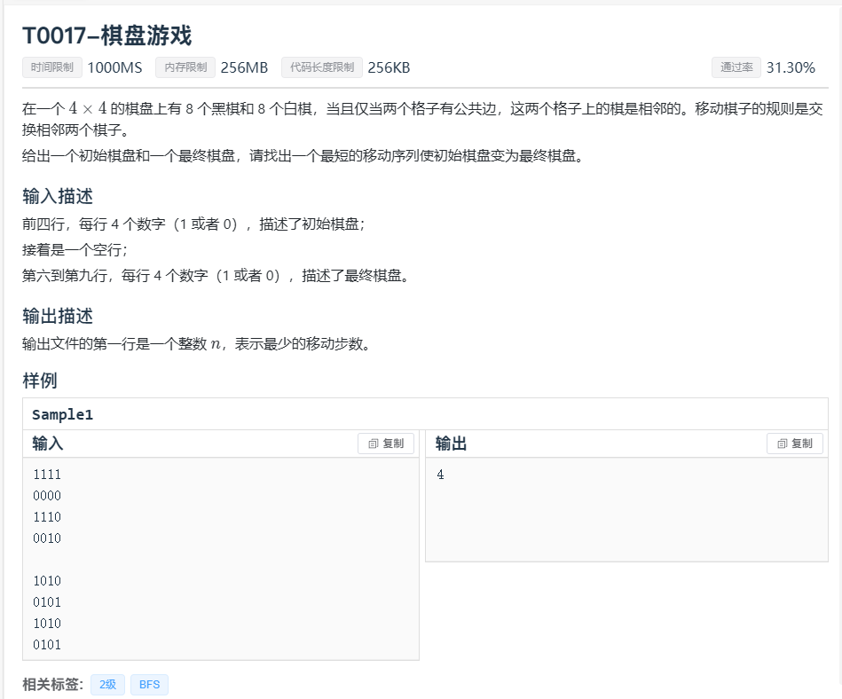
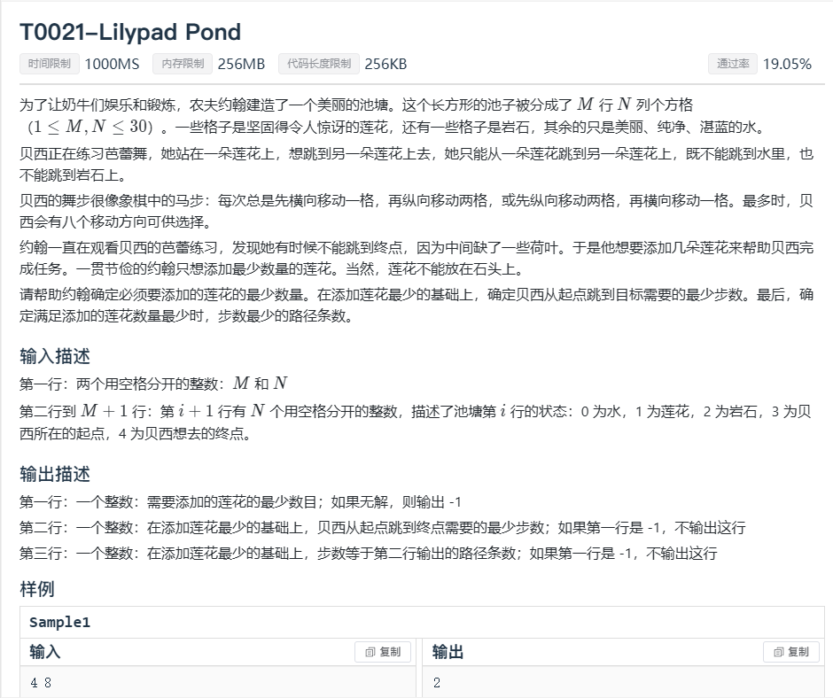
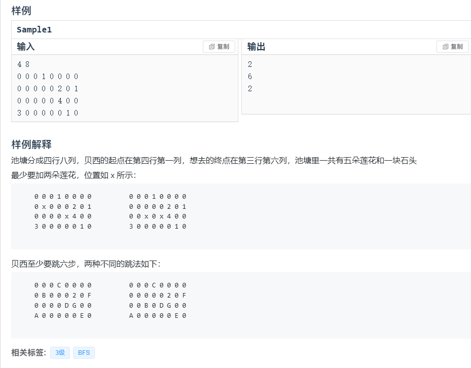

## 第一题



```c++
//
// Created by KingQAQuuu on 2023/11/14.
//
#include "bits/stdc++.h"
using namespace std;
int n,m,k;
int maze[6][6];
bool visited[6][6];
int dx[4]{1,0,-1,0};
int dy[4]{0,1,0,-1};
bool flag;
bool isValid(int x,int y){
    return x>=0&&x<m&&y>=0&&y<n&&!visited[x][y]&&!maze[x][y];
}
void dfs(int x,int y,int step){
    if (x==m-1&&y==n-1){
        if (step==k){
            flag=true;
        }
        return;
    }
    int nx,ny;
    visited[x][y]= true;
    for (int i = 0; i < 4; ++i) {
        nx=x+dx[i];
        ny=y+dy[i];
        if (isValid(nx,ny)){
            dfs(nx,ny,step+1);
        }
    }
    visited[x][y]= false;
}
int main(){
    cin>>n>>m>>k;
    for (int i = 0; i < n; ++i) {
        for (int j = 0; j < m; ++j) {
            cin>>maze[i][j];
        }
    }
    dfs(0,0,0);
    if (flag){
        printf("Yes");
    }else{
        printf("No");
    }
}
```

------

## 第二题




```c++
//
// Created by KingQAQuuu on 2023/11/15
//
#include<bits/stdc++.h>
using namespace std;
int n,mm,ans=1e9;
int ss[130],vv[130];
inline void DFS(int v,int s,int m,int r,int h){
    if(2*(n-v)/r+s>ans)return;
    if(v+vv[m]>n)return;
    if(s+ss[m]>ans)return;
    if(m==0){
        if(v==n)ans=min(s,ans);
        return;
    }

    for(int i=r-1;i>=m;i--){
        if(m==mm)s=i*i;
        for(int j=min((n-v-vv[m-1])/(i*i),h-1);j>=m;j--){
            DFS(v+i*i*j,s+2*i*j,m-1,i,j);
        }
    }
}
int main(){
    cin>>n>>mm;
    ss[0]=0;vv[0]=0;
    for(int i=1;i<=17;i++){
        ss[i]=ss[i-1]+2*i*i;
        vv[i]=vv[i-1]+i*i*i;
    }
    DFS(0,0,mm,sqrt(n),sqrt(n));
    if(ans==1e9)cout<<0;
    else cout<<ans;
    return 0;
}
```

------

## 第三题






```

```


------

## 第四题


```c++
#include "bits/stdc++.h"
using namespace std;
int n,ans=1000000;
int visited[1000000];
struct block{
    int x;
    int step;
};
queue<block> r;
int main() {
    scanf("%d",&n);
//BFS
    block start{1,0};

    r.push(start);//将起点入队
    visited[1]= true;
    while(!r.empty())
    {
        int x = r.front().x;
        if (x==n) {
            if (r.front().step<=ans){
                ans=r.front().step;
            }
        }
        if (r.front().x-1>=0&&!visited[r.front().x-1])
        {
            block temp;
            temp.x=r.front().x-1;
            temp.step=r.front().step+1;
            r.push(temp);
            visited[r.front().x-1]=1;
        }
        if (r.front().x+1<=n&&!visited[r.front().x+1])
        {
            block temp;
            temp.x=r.front().x+1;
            temp.step=r.front().step+1;
            r.push(temp);
            visited[r.front().x+1]=1;
        }
        if (r.front().x*2<=n&&!visited[r.front().x*2])
        {
            block temp;
            temp.x=r.front().x*2;
            temp.step=r.front().step+1;
            r.push(temp);
            visited[r.front().x*2]=1;
        }
        r.pop();
    }
    printf("%d",ans);
    return 0;
}

```

------

## 第五题



```c++
//
// Created by KingQAQuuu on 2023/11/13.
//
#include "bits/stdc++.h"
using namespace std;
int ans,startBlcok,endBlock;
bool visited[1000000];
struct node{
    int num;
    int step;
};
queue<node> q;
void bfs(){
    q.push((node){startBlcok,0});
    while(!q.empty()){
        node temp;
        temp.num=q.front().num;
        temp.step=q.front().step;
        if(temp.num==endBlock){
            printf("%d\n",temp.step);
            return;
        }
        for (int i = 15; i >=0 ; i--) {
            int x=(15-i)/4,y=(15-i)%4,w=1<<i;
            int rz=1<<(i-1),dz=1<<(i-4);
            if(y<3&&(temp.num&w)!=(temp.num&rz))
            {
                if(!visited[temp.num^w^rz])
                {
                    visited[temp.num^w^rz]= true;
                    q.push((node){temp.num^w^rz,temp.step+1});
                }
            }
            if(x<3&&(temp.num&w)!=(temp.num&dz))
            {
                if(!visited[temp.num^w^dz])
                {
                    visited[temp.num^w^dz]= true;
                    q.push((node){temp.num^w^dz,temp.step+1});
                }
            }
        }
        q.pop();
    }
}
int main(){
    char c;
    for (int i = 15; i>=0; i--) {
        cin>>c;
        if (c=='1'){
            startBlcok+=1<<i;
        }
    }
    for (int i = 15; i>=0; i--) {
        cin>>c;
        if (c=='1'){
            endBlock+=1<<i;
        }
    }
    if (startBlcok==endBlock){
        printf("0\n");
    }
    else {
        bfs();
    }
    return 0;
}
```

------

## 第六题





```

```

------

## 第七题


```C++
//
// Created by KingQAQuuu on 2023/11/15.
//
#include <stdio.h>

int n, m;                   // 点数n和边数m
const int N = 1e5 + 10;
int h[N], e[N], ne[N], idx; // 构建邻接矩阵
int q[N], d[N];             // 队列q和记录入度数组d

void add(int a, int b){     // 头插法
    e[idx] = b, ne[idx] = h[a], h[a] = idx++;
}

bool topsort(){
    int front = 0, rear = 0;
    for(int i = 1; i <= n; i++)             // 从编号1开始将所有入度为0的点入队
        if(!d[i])       q[rear++] = i;

    while(front < rear){
        int x = q[front++];
        for(int i = h[x]; i != -1; i = ne[i]){      // 获取入度为0的点的下一个邻接点
            int j = e[i];
            d[j]--;                                 // “删除”结点x后，与之相邻的结点j入度减一
            if(!d[j])       q[rear++] = j;      // 当结点j入度为0时，将其入队
        }
    }
    return rear == n;       // 当所有序列均入队时，说明是按照拓扑排序入队，反之则不为拓扑序列
}


int main(){
    scanf("%d%d", &n, &m);
    for(int i = 0; i <= n; i++)      h[i] = -1;     // 初始化邻接矩阵中的顶点表指向“空指针”
    while(m--){
        int a, b;       scanf("%d%d", &a, &b);
        add(a, b);
        d[b]++;         // 结点b的入度加一
    }
    if(topsort()){      // 若为拓扑排序，则输出拓扑序列
        for(int i = 0; i < n; i++)		printf("%d ", q[i]);
        puts("");
    }else
        puts("-1");

    return 0;
}
```

