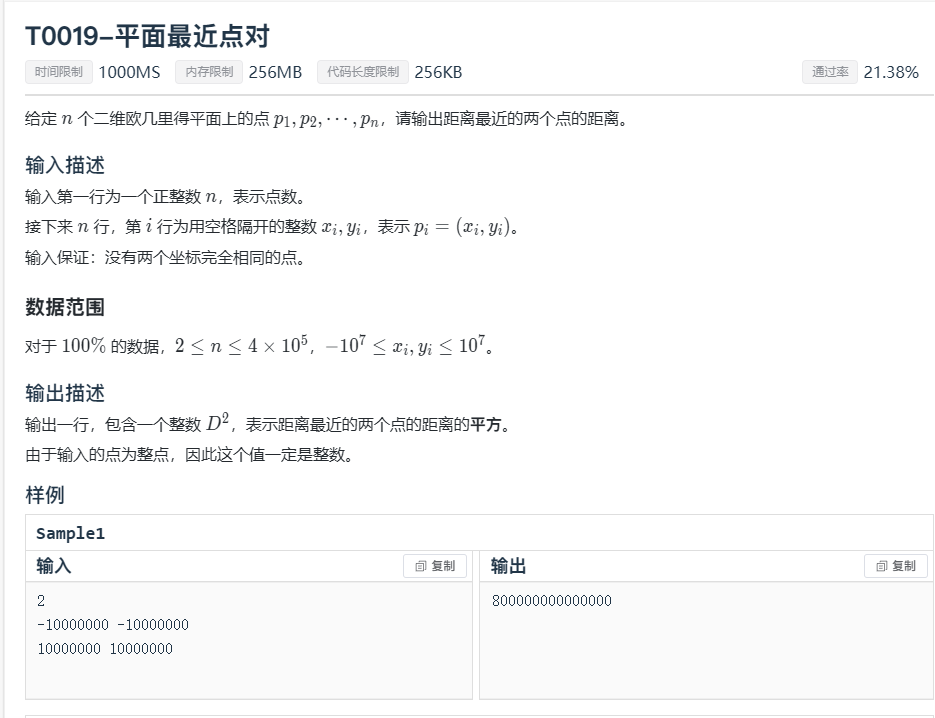
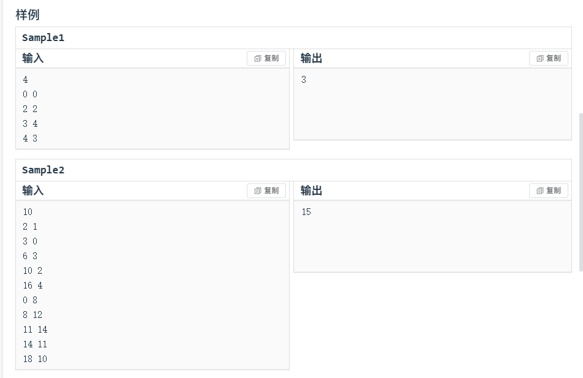
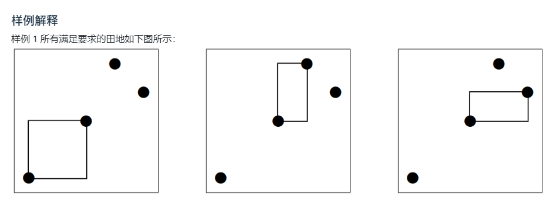

## 第一题


```c++
//
// Created by KingQAQuuu on 2023/11/13.
//
#include "bits/stdc++.h"
using namespace std;
int a[100005];
int solve(int l,int r)
{
    if(l<1||r<1)return 0;
    if(l>r)return 0;
    if(l==r)return min(a[l],1);
    int m=1111111111,w=0;
    for(int i=l;i<=r;i++)
        if(a[i]<m)
        {
            m=a[i];
            w=i;
        }
    int j=a[w];
    for(int i=l;i<=r;i++)
        a[i]-=j;
    int lf=solve(l,w-1);
    int rg=solve(w+1,r);
    return min(j+lf+rg,r-l+1);
}
int main()
{
    int n;
    scanf("%d",&n);
    for(int i=1;i<=n;i++)
        scanf("%d",&a[i]);
    int ans=min(n,solve(1,n));
    printf("%d\n",ans);
    return 0;
}
```

------

## 第二题




```c++
//
// Created by KingQAQuuu on 2023/11/13.
//
#include "bits/stdc++.h"
#define up(l,r,i) for(int i=l,END##i=r;i<=END##i;++i)
using namespace std;
struct Point{int x,y;};
typedef vector<Point>::iterator Iter;
bool cmpx(const Point a,const Point b){return a.x<b.x;}
bool cmpy(const Point a,const Point b){return a.y<b.y;}
double dis(const Point a,const Point b){
    return sqrt(pow(a.x-b.x,2)+pow(a.y-b.y,2));
}
void slv(const Iter l,const Iter r,double &d){
    if(r-l<=1) return;
    vector<Point> Q; Iter t=l+(r-l)/2;double w=t->x;
    slv(l,t,d),slv(t,r,d),inplace_merge(l,t,r,cmpy);
    for(Iter x=l;x!=r;++x)
        if(abs(w-x->x)<=d) Q.push_back(*x);
    for(Iter x=Q.begin(),y=x;x!=Q.end();++x){
        while(y!=Q.end()&&y->y<=x->y+d) ++y;
        for(Iter z=x+1;z!=y;++z) d=min(d,dis(*x,*z));
    }
}
vector<Point> X; int n; double ans=1e18;
int qrd(){
    int w=1,c,ret;
    while((c=getchar())> '9'||c< '0') w=(c=='-'?-1:1); ret=c-'0';
    while((c=getchar())>='0'&&c<='9') ret=ret*10+c-'0';
    return ret*w;
}
int main(){
    n=qrd(); up(0,n-1,i){
        int x=qrd(),y=qrd(); X.push_back({x,y});
    }
    sort(X.begin(),X.end(),cmpx),slv(X.begin(),X.end(),ans);
    printf("%.0lf\n",ans*ans);
    return 0;
}
```

------

## 第三题







```

```

