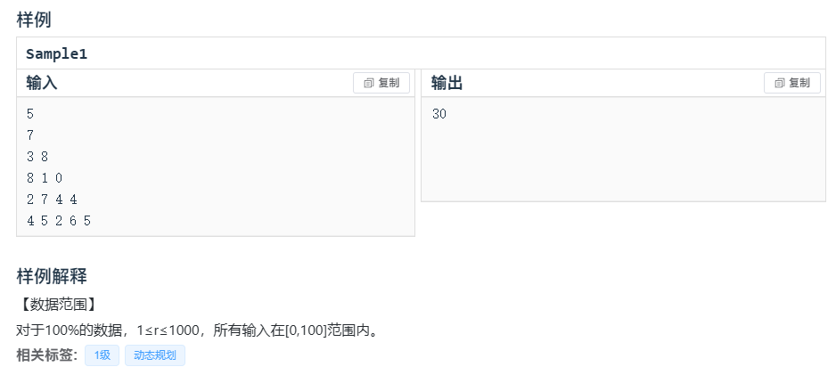
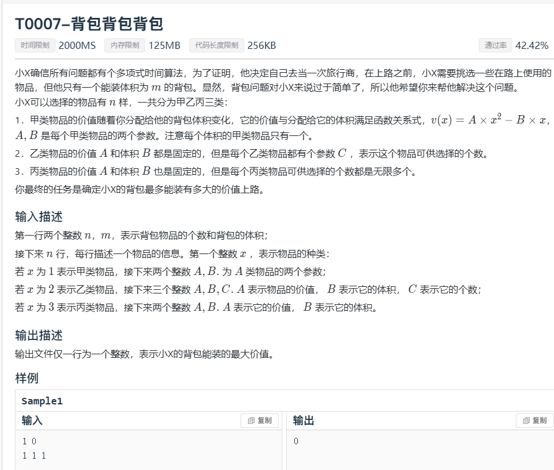

## 第一题




```c++
//
// Created by KingQAQuuu on 2023/11/14.
//
#include "bits/stdc++.h"
using namespace std;
int r;
int f[1010][1010];
int pyramid[1010][1010];
int main(){
    cin>>r;
    for (int i = 1; i <= r; ++i) {
        for (int j = 1; j <= i; ++j) {
            cin>>pyramid[i][j];
        }
    }
    for (int i = 1; i <= r; ++i) {
        f[r][i]=pyramid[r][i];
    }
    for (int i = r; i >=1 ; i--) {
        for (int j = i; j >=1 ; j--) {
            f[i][j]=pyramid[i][j]+ max(f[i+1][j],f[i+1][j+1]);
        }
    }
    cout<<f[1][1]<<endl;
    return 0;
}
```


------

## 第二题


```c++
//
// Created by KingQAQuuu on 2023/11/14.
//
#include "bits/stdc++.h"
using namespace std;
int n,m;
int cost[30];
int value[30];
long long f[30010];
int main(){
    cin>>n>>m;
    for (int i = 1; i <= m; ++i) {
        cin>>cost[i]>>value[i];
    }
    for (int i = 1; i <= m ; ++i) {
        for (int j = n; j >=cost[i]; j--) {
            if(j>=cost[i]){
                f[j]=max(f[j],f[j-cost[i]]+cost[i]*value[i]);
            }
        }
    }
    cout<<f[n];
}
```


------

## 第三题




```

```

