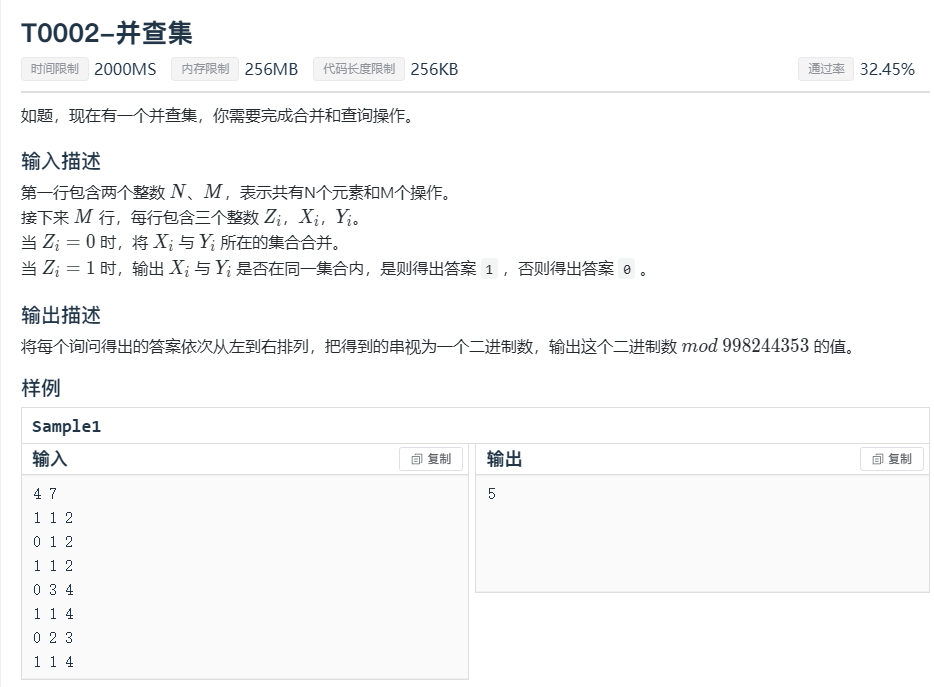
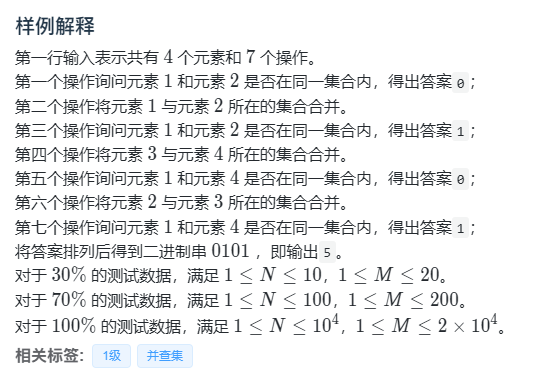
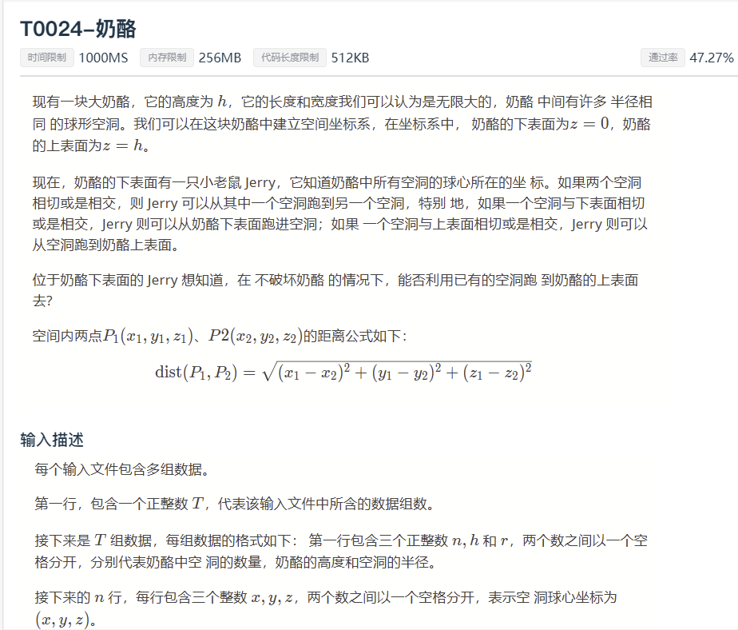

```c++
//
// Created by KingQAQuuu on 2023/12/2.
//
#include "bits/stdc++.h"
using namespace std;
int fa[10005];
int n,m;
long long ans;
void init(int x){
    for (int i = 1; i <= x; ++i) {
        fa[i]=i;
    }
}
int findd(int x){
    if(x==fa[x]){
        return x;
    }else{
        fa[x]= findd(fa[x]);
        return fa[x];
    }
}
void unionn(int i,int j){
    int i_fa= findd(i);
    int j_fa= findd(j);
    fa[i_fa]=j_fa;
}
int main(){
    cin>>n>>m;
    init(n);
    int x,y,opt;
    for (int i = 0; i < m; ++i) {
        cin>>opt;
        if (opt==0){
            scanf("%d%d",&x,&y);
            unionn(x,y);
        }
        if (opt==1){
            scanf("%d%d",&x,&y);
            int x_fa= findd(x);
            int y_fa= findd(y);
            if (x_fa==y_fa){
                ans*=2;
                ans++;
                ans%=998244353;
            }else{
                ans*=2;
                ans%=998244353;
            }
        }
    }
    cout<<ans;
}
```

------




```c++

```

