## Win32攻防工具使用与序列号分析

​	调试程序，输入 1234-1234-1234-1234，弹出对话框提示输入错误，并同时得知序列号形式为“xxxx-xxxx-xxxx-xxxx”，如上图。利用 OD智能搜索引擎——中文搜索功能找到序列号识别位置如下图

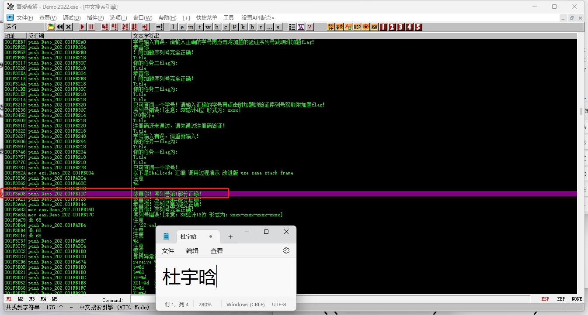

输入1234-1235-1236-1237并双击序列号识别位置，如下图

在每个比较判断的地方下断点并单步调试，这里第一部分可以看到si为输入的第一部分，cx则是需要比对的值，因此找到了第一段序列号D6C0，经测试，确实是，如下2图

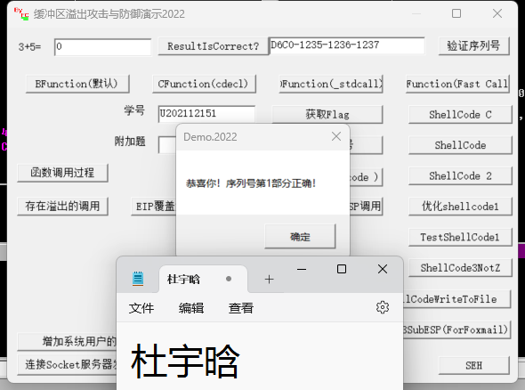

同理，继续调试第二部分序列号di为输入值，而word ptr ds:[ 0x206BF2]为比较值，得到了第二部分序列号0011，经测试正确，如下2图

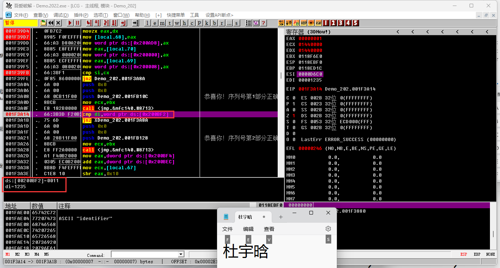

​    同理，找到第三段序列号，cx为输入值，ax为比较值，得到第三部分序列号01EF，经测试正确，如下2图

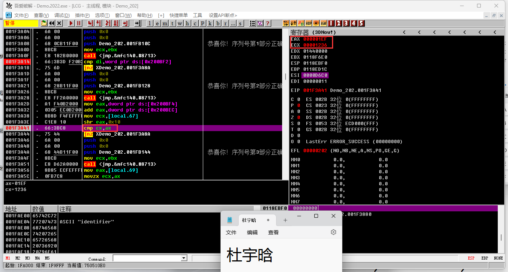

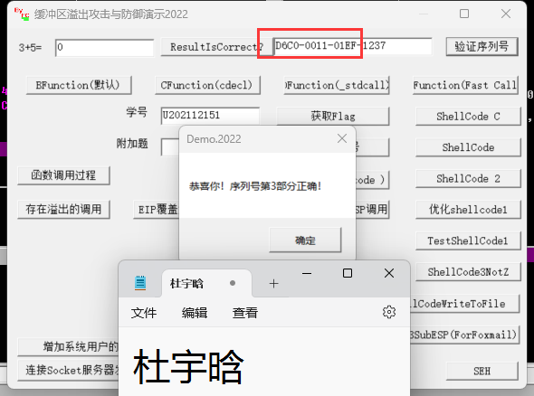

​    第四部分的序列号并不是直接得到，通过下图1分析，key4是经过计算得，计算过程如下图2，化简后得到的第四部分如下图3，自己编写代码得到第四部分序列号DEB6如下图4，验证正确如下图5，得到flag为82ae1e如下图6

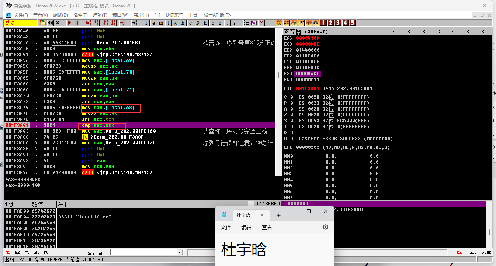

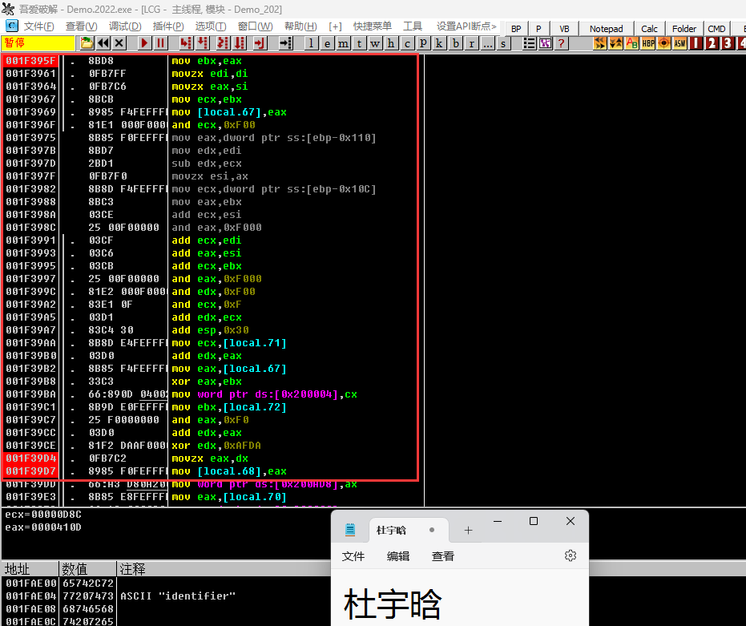

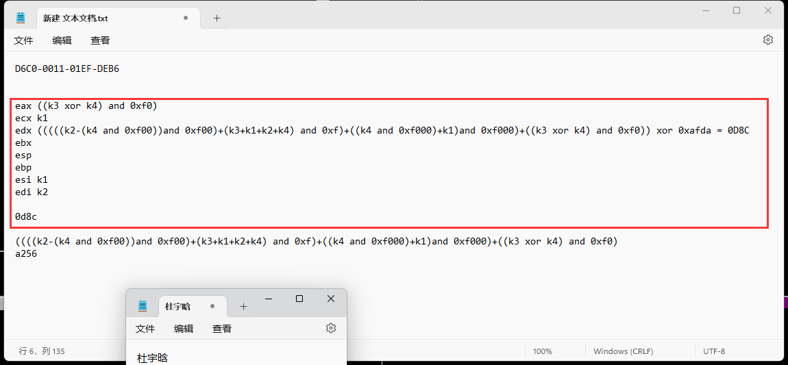

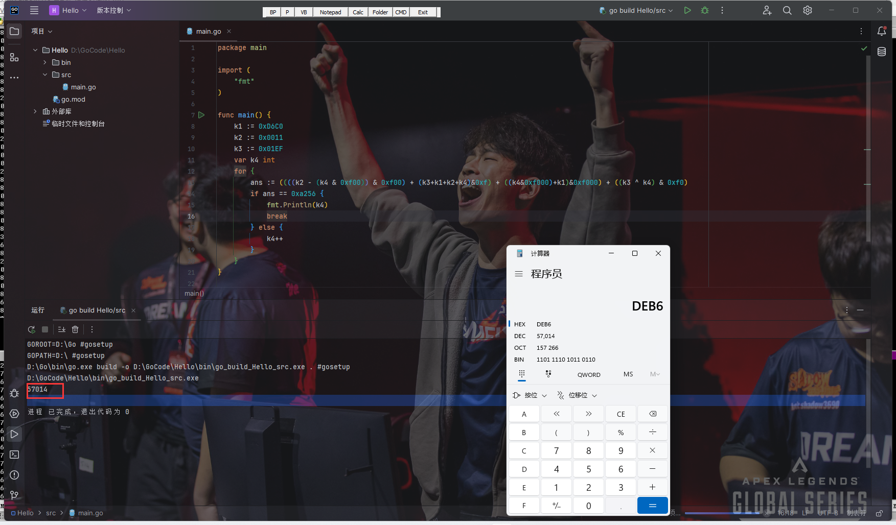

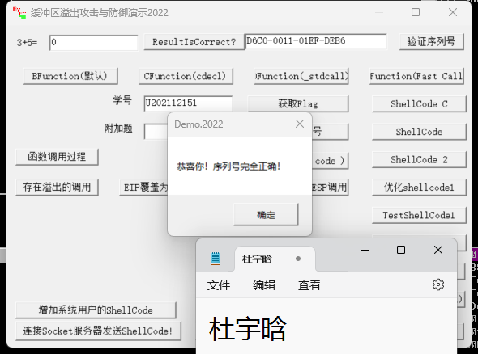

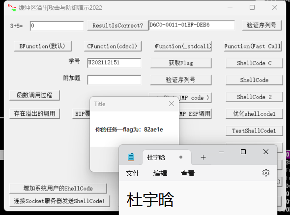